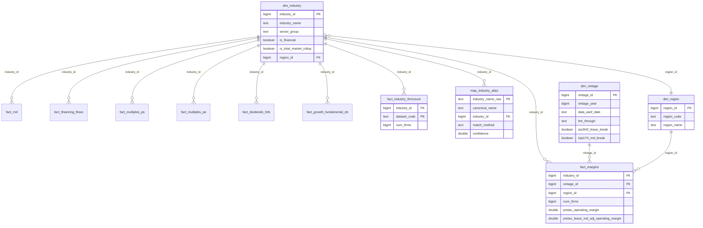

# Schema — Industry Value-Chain warehouse

A conformed **star schema**: one `dim_industry` spine, `dim_vintage` + `dim_region`
(so a single snapshot becomes a panel with zero remodeling), one **fact per Damodaran
dataset** at grain `industry × vintage × region`, an alias crosswalk as the
entity-resolution control point, and a wide `mart_industry_wide` view built by
LEFT-joining every fact.

## Tables
| Table | Grain | Rows | Notes |
|-------|-------|------|-------|
| `dim_industry` | industry × region | 94 | conformed spine; `is_financial` flags non-comparable-margin sectors |
| `dim_vintage` | annual refresh | 1 | `asc842_lease_break`/`tcja174_rnd_break` gate cross-vintage comparisons |
| `dim_region` | region | 1 | US only in v1; region_id already in every fact grain |
| `map_industry_alias` | raw-name variant | 1 | e.g. `Heathcare…`→`Healthcare…`; the anti-join control point |
| `fact_margins` | industry × vintage × region | 94 | reported + R&D/lease-adjusted operating margins, cost ratios |
| `fact_rnd` | " | 94 | R&D intensity + Damodaran's capitalized-R&D **estimate** |
| `fact_financing_flows` | " | 94 | dividends/buybacks/issuance/debt; `net_equity_change_usd = issuance − buybacks` |
| `fact_multiples_ps` | " | 94 | Price/Sales, **EV/Sales** (multiples — not percentages) |
| `fact_multiples_pe` | " | 94 | Current/Trailing/Forward PE, PEG, expected growth |
| `fact_dividends_fcfe` | " | 94 | payout, FCFE, net cash returned / FCFE |
| `fact_growth_fundamental_eb` | " | 94 | ROC, reinvestment rate, expected EBIT growth (local `fundgrEB.xls`) |
| `fact_industry_firmcount` | industry × vintage × region × dataset | 658 | firm-count reconciliation across all files (PK includes `dataset_code`) |
| `mart_industry_wide` (view) | industry × vintage × region | 94 | LEFT JOIN of all facts; every measure **source-prefixed** (`mgn_`, `rnd_`, `ff_`, `ps_`, `pe_`, `div_`, `gr_`) to avoid collisions like `net_margin` |

## Design decisions
- **Join on a surrogate `industry_id`, never the raw string.** Damodaran's free-text
  `Industry Name` carries a real typo (`Heathcare Information and Technology`) and drifts
  across files/years; the alias crosswalk + a fail-loud anti-join gate catch it.
- **`dim_vintage` from day one.** Files are overwritten every January, so the vintage is
  stamped at ingest (hashed) and modeled as a dimension — the same schema becomes a
  multi-year panel by stacking archived vintages.
- **Right-sized.** ~8 facts, not 30. Proportionality over gold-plating.
- **Units:** money in USD millions (`double`), ratios as fractions, multiples raw.
